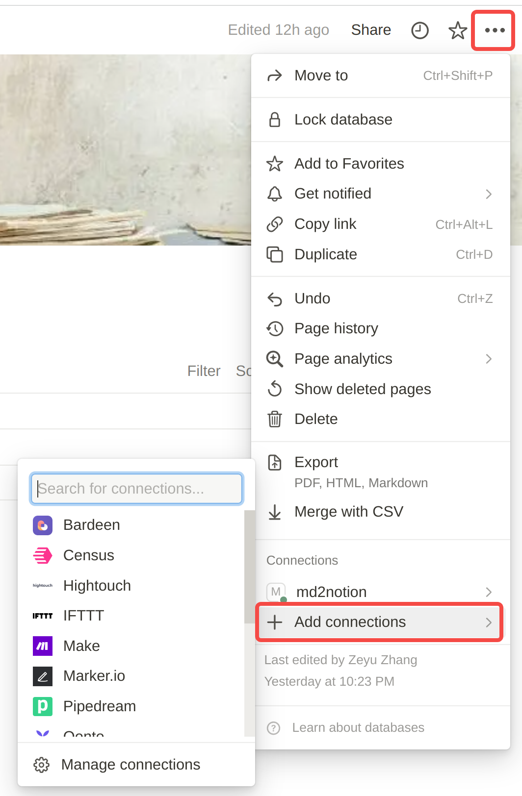

# Markdown Notion Importer

#tutorial #config #python #notion #installation

This is a tutorial of **importing Markdown notes to Notion**. Here, I briefly introduce the installation steps and a simple usage example. 

Of note, this package is developed based on [this repo](https://github.com/veya2ztn/md2notion_api_version).

## 1. Installation

### 1.1 Install Markdown Notion Uploader

Download [this repo](https://github.com/TooSchoolForCool/md2notion_api_version), and install its dependencies.

```bash
git clone https://github.com/TooSchoolForCool/md2notion_api_version.git
cd <md2notion_api_version>
pip install -r requirements.txt
```

Note that `<md2notion_api_version>` refers to the directory where you downloaded the repo.

### 1.2 Modify the mistletoe package

The `mistletoe` is a python package that parses Markdown files. However, there is a internal parsing issue when you use it for importing Markdown notes to Notion since it does not recognize the equation block when identifying the markdown *emphasis* syntax `_content_`. Thereby, we need to manually fix this issue after we install this package. (Of note, this package was already installed in the previous step).

Find and edit the file `core_tokens.py` in the package `mistletoe`. Noted that, if you install this package in a virtual environment, it usually located at

```bash
~/.virtualenvs/<virtualenv>/lib/pythonx.x/site-packages/mistletoe
```

Here `<virtualenv>` refers to the name of your virtual environment and `pythonx.x` refers to a specific version of your python.

Then add following lines to the function `find_core_tokens()` in file `core_tokens.py`.


```python
"""<other code>
code_pattern = re.compile(r"(?<!\\|`)(?:\\\\)*(`+)(?!`)(.+?)(?<!`)\1(?!`)", re.DOTALL)
"""
equation_pattern = re.compile(r"(?<!\\)(?:\\\\)*(\$+)(?!\$)(.+?)(?<!\$)\1(?!\$)", re.DOTALL)

def find_core_tokens(string, root):
    """<other code>
    code_match = code_pattern.search(string)
    """
    equation_match = equation_pattern.search(string)
    
    """<other code>
    while i < len(string):
        if code_match is not None and i == code_match.start():
            if in_delimiter_run is not None:
                delimiters.append(Delimiter(start, i if not escaped else i-1, string))
                in_delimiter_run = None
                escaped = False
            _code_matches.append(code_match)
            i = code_match.end()
            code_match = code_pattern.search(string, i)
            continue
    """
        if equation_match is not None and i == equation_match.start():
            if in_delimiter_run is not None:
                delimiters.append(Delimiter(start, i if not escaped else i-1, string))
                in_delimiter_run = None
                escaped = False
            i = equation_match.end()
            equation_match = equation_pattern.search(string, i)
            continue
        
        """<other code>
        c = string[i]
        """
    
    """<other code>
    process_emphasis(string, None, delimiters, matches)
    return matches
    """
```

Note that, every time you upgrade this package, you need to redo this step.

## 2. Usage

### 2.1 Configuration

In order to use this Markdown Notion Uploader, we need several information:

- **Notion Integration Token**: Following [this page](https://www.notion.so/my-integrations) to setup your Notion integration token. This token allows our program to access your Notion database.
- **Database ID**: Your notion database ID. Note that, this should be a *Database* page. The url of database page follows a form of `https://www.notion.so/xxx/<database-id>?v=<viewer-id>`. You can obtain the database ID from the url. A valid database ID looks like `a8aec43384f447ed84390e8e42c2e089`
- **SMMS Token**: [SM.MS](https://sm.ms/) is a image server that allows us to upload our image and access it via a url. We use this server to upload the image to Notion (i.e., upload the image to SM.MS and access it via url in Notion). The SMMS token could be obtain from [this page](https://sm.ms/home/apitoken) once you create an account.

Note that you need to **add your Integration token to your database** in Notion by adding a connection to corresponding integration of the token. Below is an example of how to setup the connection in Notion web page. 



### 2.2 Markdown Uploader

We usage a YAML file to configure the aforementioned information, the YAML file format is as following

```yaml
notion_token: secret_<xxxxxx>
database_id: a8aec43384f447ed84390e8e42c2e089
smms_token: xxxxxx
```

Then, we can run following command to upload a local Markdown file to the target database in Notion.

```bash
cd <md2notion_api_version>
python notion_uploader.py -c <markdown-file-dir> --cfg=<config-yaml-dir>
```

### 2.3 A Shell Shortcut

We can create a SHELL function to use it like a tool anywhere. Add following lines to your SHELL configuration script (e.g., `.zshrc`, `.bashrc`, etc.).

```shell
###############################################
# Update Markdown to Notion Database
#
# Usage:
#       md2notion <markdown-file-dir>
###############################################
function md2notion(){
    if [ -z "$1" ]
    then
        echo "Usage:\n\tmd2notion <file-dir>"
    else
        # activate notion environment
        workon notion

        # generate cmd
        cmd="python <md2notion_api_version>/notion_uploader.py"
        cmd+=" -c $1 --cfg=<config-yaml-dir>"

        # print out the command
        echo ${cmd}
        # execute the command
        eval ${cmd}
    fi
}
```

Then we can use it as follows:

```bash
md2notion <markdown-file-dir>
```

## 3. Issues

Currently, the notion API doesn't support upload files.